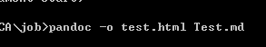

# 书签  
也许会有用，需要整理

## [SharePoint WebPart](http://www.cnblogs.com/jianyus/p/3458374.html)
- [sharepoint：Web部件](http://cnc.ucr.edu/sharepoint/webparts.html)
- [SP API](https://msdn.microsoft.com/en-us/library/office/ee538683(v=office.14).aspx)
- [创建母版页](http://www.voidcn.com/article/p-bycprrlk-nx.html)

- [自定义母版页小技巧——JAVASCRIPT和CSS引用](https://www.debugrun.com/a/iZK32jH.html)
- [Markdown2HTML](http://gui.avepoint.net/)
- [一段JS代码让Markdown自动生成侧边栏目录](https://www.jianshu.com/p/34c92cbd0aaf)

## [React总汇](http://www.360doc.com/content/16/1108/10/17722897_604827790.shtml)
- [在线编译](https://codepen.io/rohan10/pen/qRqmjd)
- [webpack](https://github.com/theJian/build-a-hn-front-page)
- [创建无配置应用](https://reactjs.org/blog/2016/07/22/create-apps-with-no-configuration.html)
- [webpack傻瓜指南](https://zhuanlan.zhihu.com/p/20367175)
- [npm&package.json](https://segmentfault.com/a/1190000007624021)
- [webpack 配css](https://www.jianshu.com/p/725740f68ea3)
- [What is WebPack](https://www.jianshu.com/p/b95bbcfc590d)
- [图片路径以及打包](http://www.cnblogs.com/ghost-xyx/p/5812902.html)
- [多文件打包](http://www.cnblogs.com/sloong/p/5689162.html)
- [配置postcss](https://segmentfault.com/q/1010000006987956)
- [webpack1和2变化](https://doc.webpack-china.org/guides/migrating/)
- [npm](https://juejin.im/post/59256b6f8d6d810058045336)
- [冠冕当黄React介绍](http://www.cnblogs.com/clearyang/p/6899486.html)
- [React 表单](https://discountry.github.io/react/docs/forms.html)
- [单页面应用](https://www.w3cplus.com/react/creating-single-page-app-react-using-react-router.html)
- [React 环境](https://www.w3cplus.com/react/setting-up-react-environment.html)
- [React Css](http://blog.csdn.net/pcaxb/article/details/53896661)
- [分级菜单](http://www.aichengxu.com/other/11156583.htm)
- [React tree](http://blog.csdn.net/wp12345666666/article/details/66971352?locationNum=15&fps=1)
- [simple tree](http://esprima.org/demo/parse.html#)
- [基本配置方案](https://www.w3cplus.com/react/taming-react-setup.html)
- [Redux 中文文档](http://cn.redux.js.org/)
- [fetch,ajax](http://javascript.ruanyifeng.com/bom/ajax.html#toc27)
- [fetch API](http://web.jobbole.com/84924/)
- [fetch 前车之鉴](http://blog.csdn.net/whbwhb1/article/details/53322451)
- [React 前车之鉴](http://web.jobbole.com/91075/)
- [Redux ](https://github.com/kenberkeley/redux-simple-tutorial)
- [箭头函数](http://blog.csdn.net/hacke2/article/details/40977081)
- [Redux 进阶](https://github.com/kenberkeley/redux-simple-tutorial/blob/master/redux-advanced-tutorial.md)
- [fetch 组件](https://github.com/Justin-lu/react-redux-antd/blob/master/src/utils/cFetch.js)
- [Redux Demo](https://segmentfault.com/a/1190000005933397)
- [es6](http://web.jobbole.com/tag/es6/page/2/)
- [es6字符串](http://www.cnblogs.com/wenJiaQi/p/7235390.html)
- [Reacr源码](http://web.jobbole.com/94414/)

### [sublime 搭建React](http://blog.csdn.net/yczz/article/details/50469388)
- [sublime无法使用Package Control或插件安装失败的解决方法](http://blog.csdn.net/freshlover/article/details/44261229/)
- [sublime 插件](http://bubkoo.com/2014/01/04/sublime-text-3-plugins/)
- [sublime删去多余空格配置](https://github.com/SublimeText/TrailingSpaces#deletion)

## [SQL](http://blog.knowsky.com/208115.htm)
- [SQL test](https://segmentfault.com/a/1190000005933397)
## [angularJS](http://blog.csdn.net/u014737138/article/details/50017071)
- [Angular community](http://www.angularjs.cn/A09C)
- [project](https://eservice-rpg-stg.msf.gov.sg/MSFPortal/ECRM/Pages/Index/Index.aspx)

## [C# byte[] transfer string](http://www.cnblogs.com/zhoufleru/archive/2007/06/04/770864.html)
- [byte[] json](https://bbs.csdn.net/topics/390963853)

- [buffer](http://javascript.ruanyifeng.com/nodejs/buffer.html#toc14)
- [H5 文件与二进制操作](http://www.cnblogs.com/jscode/archive/2013/04/27/3572239.html)
- [二进制数组](http://javascript.ruanyifeng.com/stdlib/arraybuffer.html#toc11)
- [data类型的Url格式及Base64编码:把小数据直接嵌入到Url中](http://www.makaidong.com/%E5%8D%9A%E5%AE%A2%E5%9B%AD%E7%9A%84/4208.shtml)
- [计时器](http://www.w3cplus.com/javascript/javaScript-setInterval.html)
- [this](http://web.jobbole.com/90295/)
- [大师兄的this](http://www.cnblogs.com/moran1992/p/8515711.html)
- [开发者工具/Json格式化/编码/解码/二进制 - 在线工具](http://www.ofmonkey.com/)
- [在线编译JS](http://codepen.io/anon/pen/oXZaBY?editors=0011)
- [V8](http://blog.crimx.com/2015/03/29/javascript-hoist-under-the-hood/)
- [翻墙](https://plus.google.com/+GhostAssassin/posts/gLDd5iDDG1V)
- [掘金 community](https://juejin.im/welcome/frontend)
## forum
- [伯乐在线-web](http://web.jobbole.com/)
## konckout
- [汤姆大叔](https://www.cnblogs.com/TomXu/archive/2011/11/21/2257154.html)
 
## CSS
- [CSS online](http://css.doyoe.com/)
- [css颜色在线转换](http://colorizer.org/)
- [Flex兼容写法](https://www.cnblogs.com/iriszhang/p/6102524.html)

- [UNICODE编码](http://blog.csdn.net/tectool/article/details/51577914)
- [XSS](https://www.lvtao.net/dev/xss.html)
- [for优化](http://www.jb51.net/article/30947.htm)
- [数组去重](http://blog.csdn.net/sinat_17775997/article/details/73558160)
- [尾调用优化](http://www.ruanyifeng.com/blog/2015/04/tail-call.html)
- [前台调用浏览器另存为对话框](http://www.cnblogs.com/youuuu/archive/2012/11/02/2750914.html)
- [JS导出Excel五种方法](http://blog.csdn.net/aa122273328/article/details/50388673)
- [less封装](http://blog.csdn.net/zghome/article/details/28272347)
- [字符串封装方法](http://www.cnblogs.com/yoainet/archive/2011/12/16/2290422.html)
- [css文字分割线](http://www.daqianduan.com/example?pid=4258)
- [javascript 客户端 创建csv并下载](http://blog.csdn.net/yuan882696yan/article/details/44489025)
- [JS 生成GUID](http://www.cnblogs.com/snandy/p/3261754.html)
- [JS字典型](http://blog.csdn.net/anialy/article/details/8295765)
- [抓包Fiddler](http://www.cnblogs.com/mcho/p/3983028.html)
- [JSON.stringify用法](https://segmentfault.com/a/1190000010846585)
- [在线画图](https://www.draw.io/?splash=0)
- [JS忍者电子版](http://yuedu.163.com/book_reader/ca925a455c20496fbb0347e695c6d817_4)
- [JS标准库](https://developer.mozilla.org/zh-CN/docs/Web/JavaScript/Reference/Global_Objects)
- [特殊字符](https://css-tricks.com/snippets/html/glyphs/)
## 不错的简历
- [markdown版本](https://github.com/Blankj/resume)
- [关于跳槽的文章](https://www.jianshu.com/p/7c700983989a)
## [Web Accessibility](https://github.com/mifengxiaochang/zaqizaba/edit/master/README.md)
- [无障碍参考文档](./accessibility%20参考文档_v1.0.2.docx)
## git
[上传本地项目](https://www.cnblogs.com/specter45/p/github.html)
## markdown
[pandoc--转换工具](https://blog.csdn.net/lanchunhui/article/details/70336595)

傻瓜步骤：
先将终端调到要转换的文件夹之后执行语句

将Markdown转换HTML、doc、语句：

-o: 输出到file文件 

-h：显示语法帮助(想干啥都在这儿了)

简单爬虫(python)

